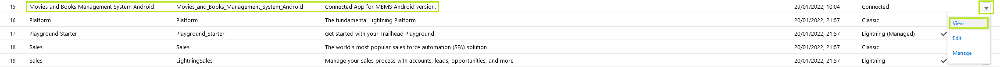

# Movies & Books Management System - Android

**Movies & Books Management System Android** is an simple **Salesforce Mobile SDK** based [Connected App](https://help.salesforce.com/s/articleView?id=sf.connected_app_overview.htm&type=5) that uses Salesforce API to access records that are available in its [Salesforce version](https://github.com/artysta/movies-and-books-management-system-salesforce).

There are two steps you have to do in order to make this application working. At first you have to deploy its Salesforce version - [Movies & Books Management System Salesforce](https://github.com/artysta/movies-and-books-management-system-salesforce). You can find the deployment instructions in the README.md file of the linked repository.

After deployment you should:
 - go to the Setup
 - search for the App Manager
 - locate **Movies_and_Books_Management_System_Android** application
 - click on the down arrow icon at the end
 - select **View** from the dropdown menu (check the screenshot below)

 

 - copy API Consumer Key
 - open **movies-and-books-management-system-android\app\res\values\bootconfig.xml** file in a text editor
 - replace **YOUR_CONSUMER_KEY_GOES_HERE** value with the key you have just copied